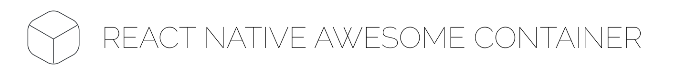
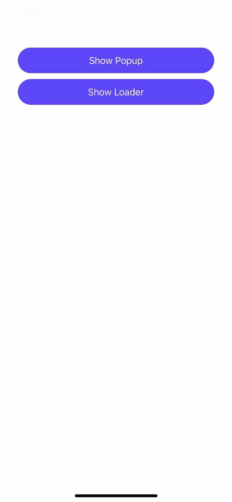

# react-native-awesome-container
[](https://www.npmjs.com/package/react-native-awesome-container) [](https://github.com/julekgwa/react-native-awesome-container) [](https://unpkg.com/react-native-awesome-container/dist/index.js) 


An easy-to-use React Native library that provides a View component with built-in loaders and popups. This library is designed to simplify the process of adding loading and popup functionality to your React Native Views with minimal setup.

[Expo Snack example](https://snack.expo.dev/@lekgwaraj/react-native-awesome-container)

## Installation

```sh
yarn add react-native-awesome-container
```

## Usage

```js
import * as React from 'react';
import { StyleSheet, View } from 'react-native';
import { Container } from 'react-native-awesome-container';

// ...

export default function App() {
  const [showPopup, setShowPopup] = React.useState(false);
  const [isLoading, setIsLoading] = React.useState(false);
  const [popupMessage, setPopupMessage] = React.useState('');

  React.useEffect(() => {
    (async () => {
      try {
        setIsLoading(true);

        const response = await fetch(
          'https://jsonplaceholder.typicode.scom/todos/1'
        );

        if (!response.ok) {
          throw new Error('Unable to get todos');
        }

      } catch (error: any) {
        setShowPopup(true);
        setPopupMessage(error?.message);
      } finally {
        setIsLoading(false);
      }
    })();
  }, []);

  return (
    <View style={styles.container}>
      <Container
        isLoading={isLoading}
        popupMessage={
          popupMessage || "You've successfully displayed a message."
        }
        popupTitle="Error"
        buttonText="OK"
        popupType={'Danger'}
        onPressPopup={() => setShowPopup(false)}
        showPopup={showPopup}
        spinner={'Grid'}
        spinnerColor="blue"
        style={styles.box}
      >
        ...
      </Container>
    </View>
  );
}

const styles = StyleSheet.create({
  container: {
    flex: 1,
    marginTop: 80,
    paddingHorizontal: 30,
    paddingBottom: 30,
  },
  box: {
    flex: 1,
    gap: 10,
  },
});
```



## Properties

| Prop  | Default  | Type | Description |
| :------------ |:---------------:| :---------------:| :-----|
| showPopup | `false` | `boolean` | Visibility of the Popup |
| popupType |  | `string` | Type of Popup (`Danger`, `Success` or `Warning`)  |
| popupTitle |  | `string` | Popup title |
| popupMessage |  | `string` | Popup message |
| onPressPopup | () => {} | `function` | onPress Popup button
| children | | `ReactNode` | React components
| isLoading | `false` | `boolean` | Visibility of the loader
| buttonText | `Close` | `string` | Popup button text
| style |  | `ViewStyle` | Style of the container
| contentStyle |  | `ViewStyle` | Style of the Popup container
| iconContentStyle |  | `ViewStyle` | Style of the icon container
| iconColor | `#000` | `string` | The color of the icon
| textBodyStyle |  | `TextStyle` | Style of the Popup's text body
| buttonStyle |  | `ViewStyle` | Style of the Popup's button
| buttonTextStyle |  | `TextStyle` | Popup's button text style
| spinnerColor | | `string` | Color of the spinner
| spinner | | `string` | Type of the spinner
| loaderOverlay | `false` | `boolean` | Visibility of the loader overlay

## Contributing

See the [contributing guide](CONTRIBUTING.md) to learn how to contribute to the repository and the development workflow.

## License

MIT

---

Made with [create-react-native-library](https://github.com/callstack/react-native-builder-bob)
